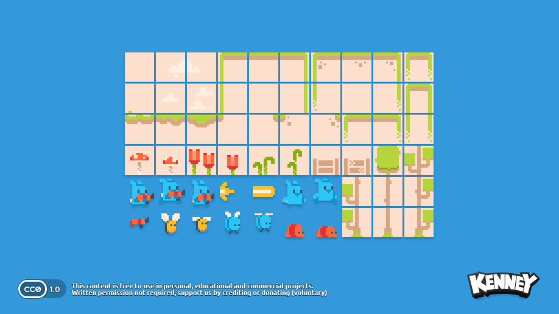
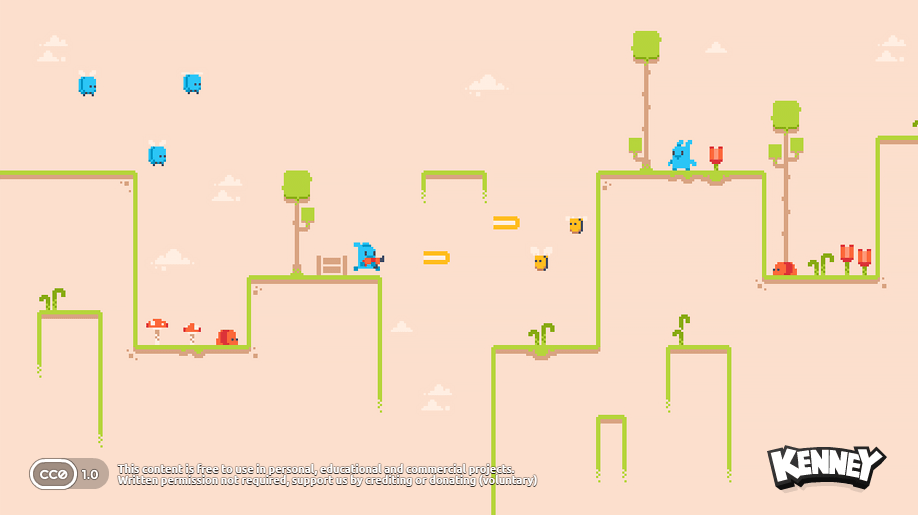

# CONCEPT

J'ai décideé de créer un petit jeu de plateforme avec un petit lapin qui doit courir pour arriver jusqu'à la fin du niveau. Le enemis seront des larmes, des mouches et des abeilles. L'univer sera une espe1ce de jungle/forêt. 

## Médias: 

### Assets : 
Tout d'abord, il y aura le background de l'univers et les personnages. 

https://kenney.nl/assets/pixel-line-platformer *source : Kenney*

 

*Voici ce à quoi mon jeu devrait ressembler*

Audio : Je n'ai pas encore trouvé d'audio adapté à mon idée. 
